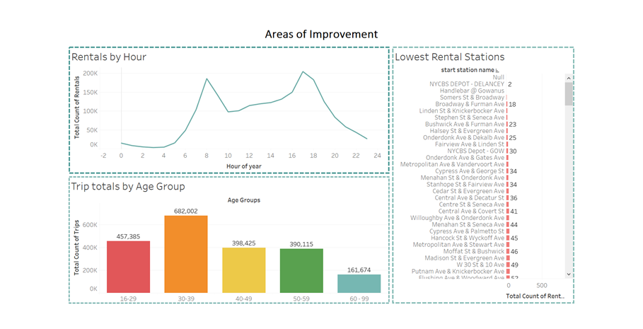
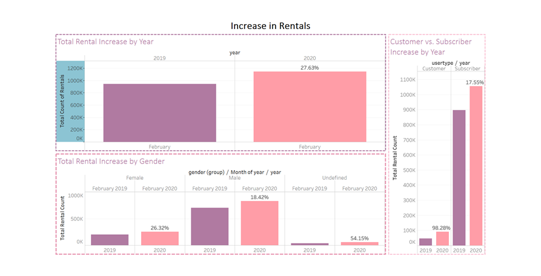

# Citi Bike Analytics – Tableau Worksheets, Story Boards, and Dashboards

## Background

Since 2013, the Citi Bike Program has implemented a robust infrastructure for collecting data on the program's utilization. Through the team's efforts, each month bike data is collected, organized, and made public on the [Citi Bike Data](https://www.citibikenyc.com/system-data) webpage.

Data found in the Citi Bike Trip History Logs will be aggregated in order to find some unexpected phenomena.

**Data from February 2019 and February 2020 has been referenced for the workbook.
**Visualizations for the discovered phenomena are included in the form of sheets, story boards, and dashboards. 

### Copyright

Data Boot Camp © 2019. All Rights Reserved.

